# ELK_Stack

<h2>Table des matières</h2>

<div class="alert alert-block alert-info" style="margin-top: 20px">
<ol>
    <li><a href="#_part1">Introduction</a></li>
    <li><a href="#_part2">La pile ELK</a>
         <ol>
    		<li><a href="#_part21">Les motivations</a></li>
            <li><a href="#_part22">ElasticSearch</a></li>
            <li><a href="#_part23">Kibana</a></li>
            <li><a href="#_part24">Logstash</a></li>
            <li><a href="#_part25">Packetbeat</a></li>
            <li><a href="#_part26">Architecture ELK</a></li>
    	</ol>
    </li>
    <li><a href="#_part3">Mise en place de la stack ELK</a>
         <ol>
            <li><a href="#_part31">Installations</a></li>
            <li><a href="#_part32">Description du fichier PCAP</a></li>
            <li><a href="#_part33">orkflow du pipeline de données</a></li>
    		<li><a href="#_part34">Création d’un index sur Kibana</a></li>             
    	</ol> 
    </li>
    <li><a href="#_part4">Dashboard Kibana</a>
         <ol>
            <li><a href="#_part41">Discover</a></li>
            <li><a href="#_part42">Dashboard Kibana</a></li>            
    	</ol> 
    </li>
    <li><a href="#_part5">Démarrage de la pile ELK</a></li>
</ol>
</div>

# 1. Introduction <a name="_part1"></a>
[comment]: <> (=================================================================================================================================)

Si la donnée est partout, la sécurité doit l’être tout autant. Le big data peut être utilisé pour analyser en continue le flux réseaux d’une entreprise et ainsi détecter des situations anormales sur le réseau et réagir le plus tôt possible à certaines attaques informatiques. Or dans un monde concurrentiel, les entreprises ne peuvent pas se permettre d’indisponibilité ou de ralentissement des performances de leurs applications car cela peut dégrader son image de marque.
C’est dans ce contexte que s’inscrit le projet ELK qui est dédié à la mise en place d’une pile logicielle pour l’analyse de grands ensembles de données réseau. Cette pile logicielle fait intervenir 3 technologies qui sont les suivantes :

• ElasticSearch

• Logstash

• Kibana


# 2. La pile ELK <a name="_part2"></a>
[comment]: <> (=================================================================================================================================)

## 2.1. Les motivations <a name="_part21"></a> 

La pile ELK stack est une combinaison de 3 projets open source : ElastricSearch, Logstash et Kibana. Ces briques logicielles ont tous été développés par l’entreprise Elastic pour le stockage et l’analyse des fichiers de logs réseaux. En fait, ELK est conçu pour permettre aux utilisateurs d’analyser et visualiser en temps réel tous types de données réseau et ce quel que soit le format des données collectées.
Une gestion des logs efficace et robuste est devenu vital pour surveiller l’état de fonctionnement l’ensemble des applications du parc informatique d’une entreprise. Pour ce faire, il convient de centraliser les logs générés par toutes les applications en un point de convergence et ainsi faciliter l’analyse des logs.
Originellement, la collecte et la vérification des logs étaient réalisées en se connectant à toutes les machines une à une. Cette méthode étant chronophage, répétitive et fastidieuse, elle n’est plus applicable de nos jours car les systèmes contiennent dorénavant énormément de machines interconnectées. En effet, dans les systèmes cloud il est plus que jamais nécessaire d’automatiser la collecte, le stockage et la vérification des logs.
De nos jours, les architectures orienté micro-services déployés dans le cloud sont très répandus. Or ce genre d’architecture composée de multiples applications et évoluant de manière indépendante génèrent des tonnes de logs. Vérifier manuellement les logs au cas par cas pour chaque application n’est pas envisageable. En effet, cela ne peut pas être fait dans des environnements constitués de centaines de conteneurs générant des To de données de logs par jour. C’est pourquoi, dans les infrastructures cloud il est important pour les administrateurs système de connaitre précisément les performances et l’état de santé des serveurs (ou machines virtuelles). En effet, ces performances peuvent varier en fonction de plusieurs facteurs externes comme par exemple la charge d’utilisation totale du système. La principale motivation de l’introduction de la pile ELK concerne donc la gestion automatisée des flux réseaux permettant aux administrateurs systèmes de prendre les meilleures décisions pour assurer la fiabilité, une bonne disponibilité du système ainsi que pour mieux réagir face à la défaillance des noeuds d’un cluster de VM.
La pile ELK permet de répondre aux besoins des administrateurs en fournissant les fonctionnalités essentielles pour l’automatisation de collecte et la visualisation des log. Ainsi ELK propose :

• **Collecte :** La collecte des logs provenant de nombreuses sources

• **Le traitement :** Les logs ne peuvent pas être directement analysées dès lors qu’ils viennent d’être collectées car il est impossible d’effectuer des opérations de filtrage sur ces dernières.

• **Stockage :** Les données sont collectées et centralisé à un endroit précis

• **Indexation :** L’indexation permet de faciliter la recherche d’un log. De plus cela est nécessaire pour le requêtage des données

• **Visualisation :** La création de dashboard facilite la compréhension et l’analyse des logs permettant ainsi de prendre de bonnes décisions assez rapidement.

## 2.2. ElasticSearch <a name="_part22"></a> 

``ElasticSearch`` est une base de données ``NoSQL`` orientée document. Celle-ci est basée sur le moteur de recherche Lucene qui permet d'indexer et de chercher du texte très rapidement. ``ElasticSearch`` dispose d’une architecture distribuée et stocke les données sous le format ``JSON`` et ce sans avoir besoin de définir préalablement un schéma de tables. L’avantage d’ElasticSearch repose sur sa capacité à rechercher en temps réel et rapidement des gros volumes de données. ``ElasticSearch`` offre également la possibilité à l’utilisateur d’appliquer des filtres sur les données. De plus, ce dernier est facile à utiliser et évolutif. Au sein de l’architecture ELK, ElasticSearch est en charge du stockage et de l’indexation des données.
Pour la couche logicielle de ``ElasticSearch`` ce qui nous intéresse dans le cadre du projet concerne deux éléments :

• **Index :** Un index est une partition logique contenant des documents, semblable à une table dans une base de données relationnelle.

• **Document :** Les documents sont l'unité de stockage de base dans ``Elasticsearch``. Un document ``JSON`` contenant des clés et des champs de différents types stocke les informations pertinentes.

## 2.3. Kibana <a name="_part23"></a> 

``Kibana`` est un outil de visualisation de données qui complète la pile ELK. Il est utilisé pour explorer et visualiser les données ingérées par ``ElasticSearch``. Il permet de rédiger une synthèse visuelle des informations extraites sur les données. Le tableau de bord de ``Kibana`` offre la possibilité à l’utilisateur de personnaliser entièrement son dashboard en proposant diverses visualisation interactives (pie chart, bar chart, line chart, carte géographique,…). Par ailleurs ``Kibana`` est également utilisé pour réaliser des requêtes complexes et afficher le résultat de cette dernière sous une forme plus compréhensible et intelligible. ``Kibana`` dispose également de fonctionnalités de recherche avancées pour affiner, filtrer, agréger les données stockées dans la base ``ElasticSearch``.

## 2.4. Logstash <a name="_part24"></a>

``Logstash`` est un outil open source d’intégration de données. ``Logstash`` établit un pipeline de collectes de données et alimente la base de données ``Elasticsearch``. Le rôle de ``logstash`` est d’unifier plusieurs types de données provenant de différentes sources et de normaliser ces derniers pour les rendre disponibles immédiatement pour une utilisation ultérieure. Pour ce faire, ``logstash`` effectue une opération de « parsing » pour extraire les informations contenues dans les données brutes puis une opération de nettoyage pour faciliter l’analyse et la visualisation des connaissances dans ``kibana``.
Dans le cadre de ce projet 3 composantes de logstash nous intéressent à savoir :

• **Entrée :** Transmission des logs pour les traiter dans un format compréhensible par la machine

• **Filtres :** Ensemble de conditions pour effectuer une action ou un événement particulier

• **Sortie :** Restitution de la données nettoyés, filtrées et agrégées.

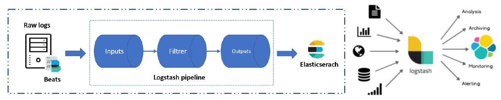

## 2.5. Packetbeat <a name="_part25"></a>

``Packetbeat`` est un agent de la suite Beats permettant l’envoi des logs. Plus concrètement, Packetbeat est capable de collecter des fichiers de capture réseau. L’objectif de ``Packetbeat`` est de parser les données contenues dans un fichier de capture réseau afin d’extraire les informations importantes sous un format compréhensible pour ``ElasticSearch``. Cet outil de pipeline de données est souvent utilisé en supplément de Logstash lorsqu’il s’agit d’effectuer des opérations de nettoyage et d’agrégation de données plus complexes avant de pouvoir les charger dans la base ``ElasticSearch``. En fait, packbeat permet de soulager la peine de ``Logstash`` en effectuant le plus gros du travail de parsing des données.

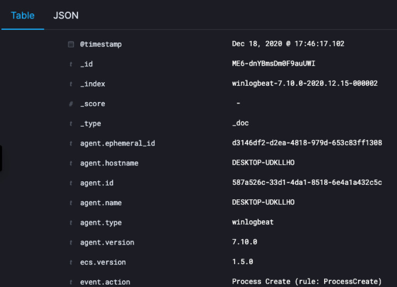

## 2.6. Architecture ELK <a name="_part26"></a>

L’architecture ELK introduit les fonctionnalités suivantes :

• **Collecte et Agrégation :** La capacité de collecter et d’extraire auprès de multiples sources de données différentes des informations contenus dans les fichiers de capture réseau.


• **Traitement :** La possibilité de transformer les logs réseau dans un format de données compréhensible pour une analyse facile.


• **Stockage :** La possibilité de centraliser à un endroit les données collectées qui seront utilisées ultérieurement pour l’analyse et la surveillance de l’utilisation des applications à des fins de sécurités informatique.


• **Analyse :** La capacité de faire parler les données en les interrogeant et en créant des visualisations et des tableaux de bord interactifs.

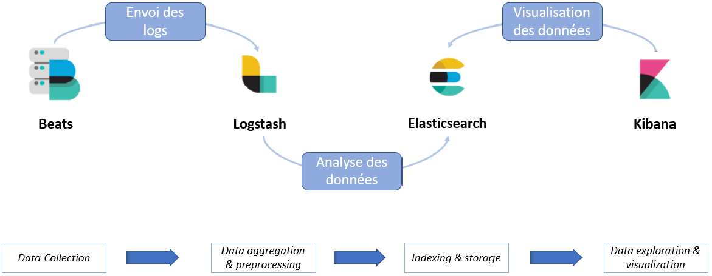

# 3. Mise en place de la stack ELK <a name="_part3"></a>
[comment]: <> (=================================================================================================================================)

## 3.1. Installations <a name="_part31"></a>

A noter que l’installation est adaptée au système Linux sous ``Ubuntu``.

### Installation des dépendances

**1. Installation de java 8**
```console
$ sudo apt-get install openjdk-8-jdk
```

**2. Installation de Nginx** 
```console
$ sudo apt-get install nginx
```

**4. Ajout d’un repository Elasticsearch** 
_Les répository d’Elasticsearch permettent d'accéder à tous les logiciels open-source de la pile ELK. Pour ce faire, il faut importer la clé GPG._
```console
$ wget -qO - https://artifacts.elastic.co/GPG-KEY-elasticsearch | sudo apt-key add –
```

**4. Installation du package atp-transport-https** 
```console
$ sudo apt-get install apt-transport-https
```

**6. Ajout le répository Elastic à la liste répository du système**
```console
$ echo "deb https://artifacts.elastic.co/packages/7.x/apt stable main" | sudo tee –a /etc/apt/sources.list.d/elastic-7.x.list
```

### Installation de la brique ELK

• Installation de ``ElasticSearch``

• Installation de ``Logstash``

• Installation de ``Kibana``

• Installation de ``Packetbeats``

L’installation de ces composantes suivent des étapes très similaires et la configuration des paramètres qui seront utilisés par ces derniers s’effectue en éditant le fichier de configuration .yml de chaque brique logicielle.

**1. Installation de la brique ELK en question**
```console
$ sudo apt-get install <elk_block> 
(ex: ```console sudo apt-get install elasticsearch```)
```

**2. Modification du fichier de configuration .yml**
```console
$ sudo nano /etc/<elk_block>/<ELK_block>.yml 
(ex : sudo nano /etc/elasticsearch/elasticsearch.yml)
```
_On répète ces lignes de commandes pour l’installation des briques logicielles Elasticsearch, Kibana et Logstash)_

### Configurations

#### Elasticsearch

Concernant la configuration d’Elasticsearch il est nécéssaire de modifier le fichier ``elasticsearch.yml`` pour définir le port utilisé par ``Elasticsearch`` ainsi que le format du cluster ``Ealsticsearch`` (``single-node`` ou ``mutli-node``) et enfin les ressources mémoires allouées par ``ElasticSearch`` à la machine virutelle Java :

```console
sudo nano /etc/elasticsearch/elasticsearch.yml
```

``elasticsearch.yml``
```network.host: localhost
http.port: 9200
discovery.type: single-node
- Xms4g
- Xmx4g
```

Un problème récurrent apparait lors du démarrage du service ``Elasticsearch``. Pour le surmonter il est nécéssaire d'augmenter le timeout du lancement de la pile ``Elasticsearch`` en modifiant le fichier ``elasticsearch.service``

**Modification du fichier ``elasticsearch.service``**
```console
$ sudo nano /usr/lib/systemd/system/elasticsearch.service
``` 

```
TimeoutStartSec=300 (timeout à 300 sec)
```

**On applique les changements**
```console
$ sudo /bin/systemctl enable elasticsearch.service
```

#### Kibana

```console
sudo nano /etc/kibana/kibana.yml
```

``kibana.yml``
```server.port: 5601
server.host: "localhost"
elasticsearch.hosts: ["http://localhost:9200"]
```

Autorisation du traffic sur le port utilisé par Kibana (5601) pour pouvoir accéder au dashboard Kibana via l’url : http://localhost:5601
```console
$ sudo ufw allow 5601/tcp
```

#### Packetbeat

**Récupération de l’archive d’installation de packetbeat**
```console
curl -L -O https://artifacts.elastic.co/downloads/beats/packetbeat/packetbeat-8.0.0-linux-x86_64.tar.gz*
```

**Décompression de l’archive d’installation**
```console
tar xzvf packetbeat-8.0.0-linux-x86_64.tar.gz
```

**Modification du fichier ``packetbeat.yml``**
Il est nécéssaire de commenter la ligne ``output.elasticsearch`` et décommenter la ligne ``output.logstash`` en y ajoutant le port de ``logstash``. Cela permet de spécifier à l’outil que les données collectées doivent être envoyé à ``Logstash`` pour que ce dernier puisse effectuer les opérations de traitement sur les données.

``packetbeat.yml``
```setep.kibana:
host:”localhost:6501”
output.logstash:
host: [“localhost:5044”]
```

**Création du fichier ``test.conf``**

Le fichier ``test.conf`` permet de définir, le port d’entrée utilisé par ``Packetbeats`` et le port de sortie utilisé par ``Elasticsearch``. Ce fichier est nécessaire pour définir la configuration du pipeline de données nécessaire pour la l’extraction, la transformation et le chargement des données dans ``Kibana``. Avec ce fichier, ``Logstash`` comprend qu’il doit récupérer les données collectées par ``PacketBeat`` et doit ensuite les envoyer à ``ElasticSearch`` pour le stockage des données prétraitées. Le fichier ``test.conf`` se présente comme ci-dessous :

**Creation du fichier ``test.conf``**
```console
$ sudno nano test.conf
```
**Modification du fichier ``test.conf``**
``test.conf``
```
input {
        beats {
            port => 5044
        }
}
output {
    elasticsearch {
        hosts => ["http://localhost:9200"]
    }
}
```

**Lecture du fichier ``PCAP``**
La lecture d’un fichier de données PCAP par le pipeline de données peut être lancé via la commande suivante :
```console
$ ./packetbeat -e -c packetbeat.yml -I <fichier.pcap>
```

## 3.2. Description du fichier PCAP <a name="_part32"></a>

``PCAP`` est une extension de fichier associé principalement au logiciel Wireshark qui permet d’analyser les paquets de données. Ainsi les fichiers ``PCAP`` sont des fichiers de données qui contiennent les paquets de données qui transitent au sein d’un réseau. Ces fichiers sont utilisés pour surveiller le trafic d’un réseau et détecter des anomalies au sein d’un réseau.
J’ai volontairement choisi un fichier ``PCAP`` très léger car après plusieurs tentatives avec d’autres fichiers ``PCAP`` plus volumineux le chargement des données dans l’interface Kibana était très long et entrainé un « chrash » de ma VM.
Pour toutes ces raisons, le fichier choisi est un fichier ``PCAP`` provenant d’un réseau de systèmes de contrôle industriels. Ce fichier est disponible [PCAP file](https://www.netresec.com/?page=DigitalBond_S4).

## 3.3. Workflow du pipeline de données <a name="_part33"></a>

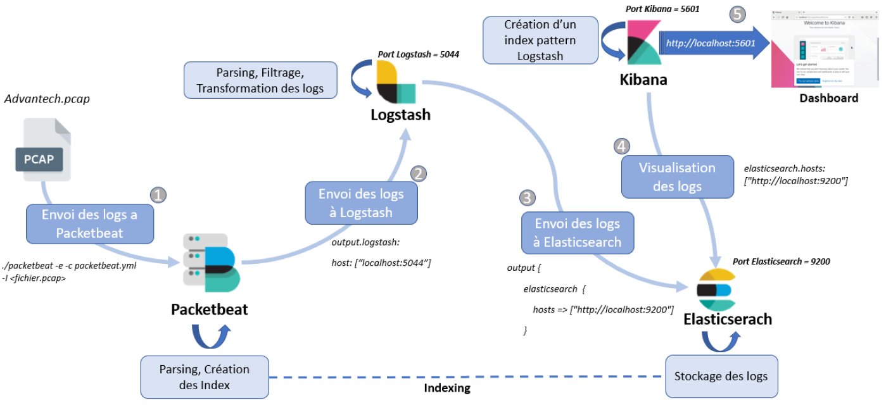

## 3.4. Création d’un index sur Kibana <a name="_part34"></a>

``Kibana`` nécessite un modèle d’index pour accéder aux données stockées dans ``Elasticsearch``. Ainsi avant de pouvoir visualiser les données il convient de créer ce que l’on appelle un « index pattern » directement dans ``Kibana``. Cette index pattern permet de spécifier à Kibana quel modèle de données suivent les données que l’on souhaite visualiser. Dans notre cas, les données ont été traitées par ``logstash``. Par conséquent le modèle de données est celui défini par ``logstash``.
Pour la création d’un « index pattern » dans ``Kibana``, il faut se rendre l’onglet « Stack Management » puis « Index Pattern». Depuis la page Index Pattern, il est possible de créer un index ``logstash``. La création d’un index ``logstash`` depuis l’interface de ``Kibana`` est décrite comme suit :

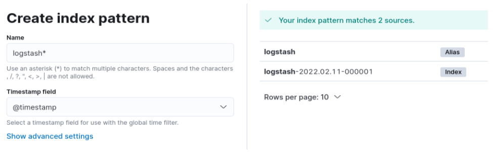

# 4. Dashboard Kibana <a name="_part4"></a>
[comment]: <> (=================================================================================================================================)

## 4.1. Discover <a name="_part41"></a>

Avant de débuter la réalisation du tableau de bords, j’ai souhaité en premier lieu me familiariser avec les données en les explorant via l’outil **Discover** de ``Kibana``. En effet cet outil facilite l’exploration des données. **Discover** permet d’avoir un aperçu rapide sur les données indexées par ``logstash``. Par ailleurs, il est possible d’obtenir des informations sur la structure des champs de notre jeu de données. Il est également possible d’appliquer des filtres afin de sélectionner certaines données de notre jeu de données et de les visualiser. Par exemple on peut choisir de visualiser les données dont le champs « timestamp» respecte une plage horaire spécifique. En résumé, **Discover** permet de requêter sur les données, filtrer le résultat de la requête et afficher les données d’un document en particulier.
L’interface de l’outil **Discover** se présente comme ci-dessous :

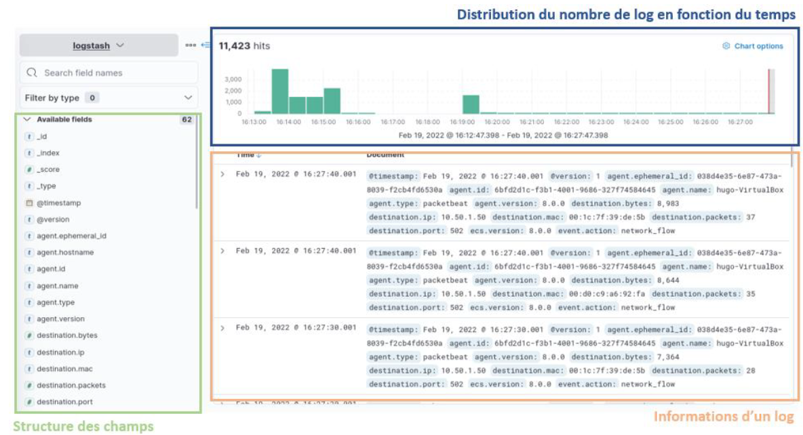

Sur la figure ci-dessous, nous avons une série de champs indexées par Logstash. Par exemple, on y trouve le champs Timestamp qui correspond à la date à laquelle l’évènement a été capture sur le réseau. On retrouve également plusieurs champs propres aux paquets de données tel que : destination.ip, destination.mac qui correspondent respectivement à l’adresse ip à laquelle ce paquet de données est destiné et l’adresse mac à laquelle ce fichier est destiné.
Pour construire le dashboard Kibana, je me suis largement appuyé sur la fonctionnalité Discover de Kibana afin d’y sélectionner les données intéressantes à visualiser. Une fois les données sélectionnées et filtrées, l’outil Discover nous propose de visualiser directement les données sélectionnées comme présenté ci-dessous.

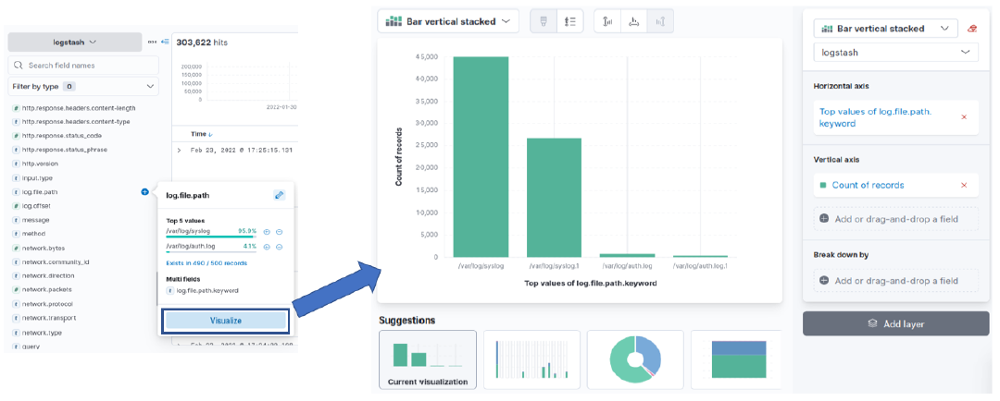

## 4.2. Dashboard Kibana <a name="_part42"></a>

L’outil dashboard de Kibana offre la possibilité de combiner plusieurs visualisations des données de logs construites à partir des index crée par Logstash. Les visualisations sont interactives dans la mesure où il est possible de survoler le graphique pour afficher la valeur exacte d’une donnée en particulier. L’avantage de l’utilisation de dashboard Kibana est qu’il est possible de mettre à jour automatiquement l’ensemble des graphiques en quasi-temps réel. Par ailleurs, cet outil offre plusieurs types de visualisations possibles tel que le diagramme en bâtons, diagrammes à barres, camemberts, courbes chronologiques, cartographie, compteurs,...

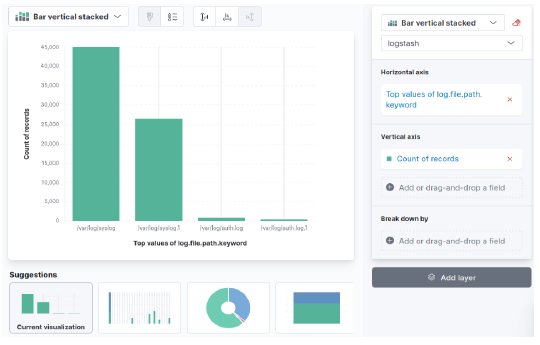

### Le dashboard

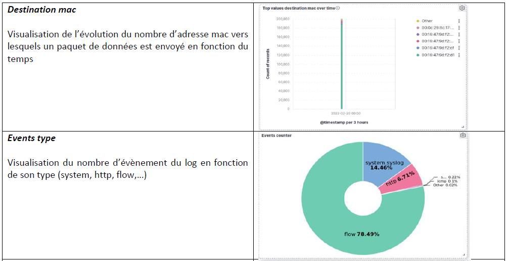

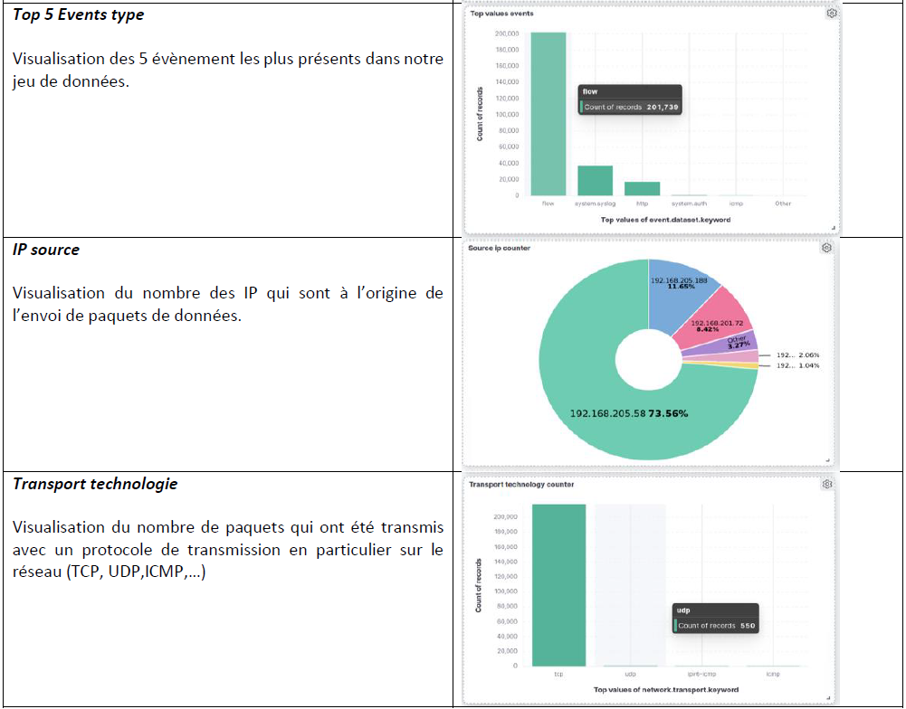

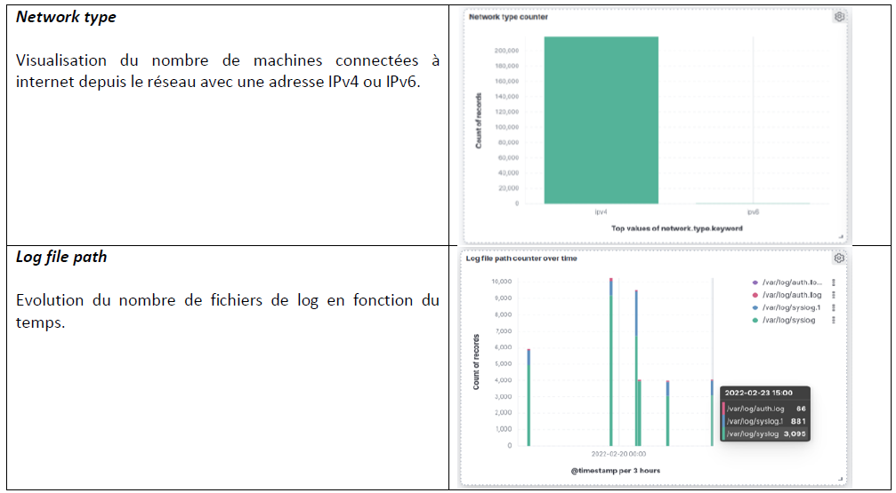

D’autres visualisations sont disponibles dans le fichier ``ndjson``. En important ce dernier dans ``Kibana`` il est possible de visualiser le dashboard complet.

# 5. Démarrage de la pile ELK <a name="_part5"></a>
[comment]: <> (=================================================================================================================================)

#### Start Elastic Search ####
```console
$ sudo systemctl start elasticsearch.service
```

#### Test Elastic ####
```console
$ curl -X GET "localhost:9200"
```

``Elasticsearch`` est accessible via le lien :
``http://localhost:9200``

#### Start Kibana ####
```console
$ sudo systemctl start kibana
```

``Kibana`` est accessible via le lien :
``http://localhost:5601``

#### Start Logstash ####
```console
$ sudo systemctl start logstash
```

#### Check Logstash status ###
```console
$ sudo systemctl status logstash
```

#### Start Packetbeat ####
_Lancer packet beat (Lecture des fichiers logs)_
```console
$ sudo ./packetbeat -e -c packetbeat.yml -I <packetbeat_path_file> -d
```
